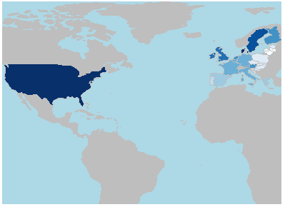
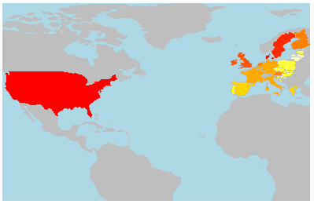

[](http://quantlet.de/)

## [](http://quantlet.de/) **SPL_Animation-Choreopleth_Map** [](http://quantlet.de/)

```yaml


Name of Quantlet: SPL_Animation-Choreopleth_Map

Published in: 'Statistical programming languages - Student Project on "Overview with Analysis of the Effects of the Currency Exchange Rate US Dollar/EUR on the European and U.S. Economy" '

Description:  produces Choreopleth Map of the European countries and the US according to GDP data for the years 2000-2014.

Keywords: Exchange rate, US, EUR, Animation, Choreopleth map, GDP

Author: Anna-Helena Mihov, Hao Cheng, Liv Jantzen

See also: SPL_Descriptive_and_Regression, SPL_reading_in_data,  SPL_Animation_Dollar_and_EUR_signs, SPL_Animation_of_Currency_Exchange_Rate_Map

Submitted:  14.08.2016

Input: 'EconData.txt'

Example: 'ChoreoBlue.png, Choreopleth.png, Choreopleth.mp4'


```





### R Code
```r

###################################################
#Chorpoleth Map of GDP EU and US
###################################################
###################################################
#http://www.r-bloggers.com/plotting-maps-with-r/
###################################################

library("sp","maps")
library("maptools")
library("RColorBrewer")
library("rworldmap")
library("GISTools")
library("shape")
library("diagram") 
library("RColorBrewer")
library("animation")
library("classInt")

dir= "C:/Users/Helen/Desktop/FinalVersion-SSPL"
setwd(dir)
GDP = read.table("GDPCountry.txt", header=TRUE, 
                 sep = "\t")
GDP = na.omit(GDP)
#naming columnes
colnames(GDP) = c('country', 2000:2014)

#saving the blue colour pallete as a picture
png('BlueShades.png')
par(mfrow=c(2,1))
display.brewer.pal(9, "Blues")
dev.off()

# producing the breaks for the GDP groups
brks    = c(2000, 4000, 8000, 12000, 16000,24000, 
            26000,28000,30000,64000)
# grouping our GDP data
GDPcut  =cut(GDP$'2000', brks)

#creating a dataframe out of the countries and their GDP group
d =data.frame(country=GDP$country, value=GDPcut)
n =joinCountryData2Map(d, joinCode="NAME",
                       nameJoinColumn="country")
dev.off()
par(mfrow=c(1,1))
png("ChoreoBlue.png")
#creating choreopleth map
mapCountryData(n, nameColumnToPlot="value", 
               mapTitle="US/EUR Currency Exchange Rate", 
               xlim=c(-120, 25), ylim=c(20, 60), 
               addLegend=FALSE, 
               colourPalette=brewer.pal(9,'Blues'), 
               oceanCol="lightblue", 
               missingCountryCol="grey")

dev.off()
####legend#####
#legend("bottomleft", "Legend",cex=0.5,pt.cex=1)
#legend("topleft", legend = levels(cut(GDP$'2000', 
# brks)), fill = cols, title = "N. stations")


###### make Animation Choreopleth map (same procedure as before)
#for one choreopleth map

#defining GDP breaks
brks = c(2000, 4000, 8000, 12000, 16000,24000,26000,
         28000,30000,64000)

#function creates choreopleth map for a year
firstChoreo = function(m = 2) {
  texto=paste("Choreo",m,".png",sep="")
  png(texto)
  GDPcut=cut(GDP[,m], brks)
  d =data.frame(country=GDP$country, value=GDPcut)
  n =joinCountryData2Map(d, joinCode="NAME", 
                         nameJoinColumn="country")
  mapCountryData(n, nameColumnToPlot="value", 
                 mapTitle=paste("US/EUR Currency Exchange Rate in the year",m+1998),
                 xlim=c(-120, 25), ylim=c(50, 55),
                 addLegend=FALSE, 
                 oceanCol="lightblue", 
                 missingCountryCol="grey")
}

#function calls the first function and pauses between the images
secondChoreo = function() {
  lapply(seq(2, length(GDP), by = 1), function(i) {
    i=2
    firstChoreo(i)
    animation::ani.pause()
  })
}

#saving the sequence of pictures as a video
saveVideo(secondChoreo(), interval = 1, outdir = dir, 
          ffmpeg = "C:/ffmpeg/bin/ffmpeg.exe",
          video.name = "ChoreoplethMap.mp4")

```

automatically created on 2018-09-04