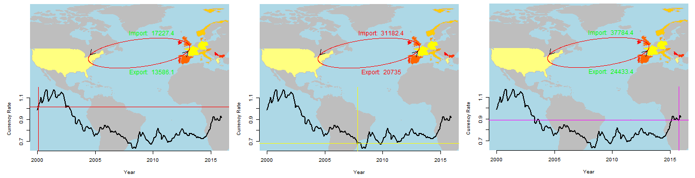

[](http://quantlet.de/)

## [](http://quantlet.de/) **SPL_Animation_of_Currency_Exchange_Rate_Map** [](http://quantlet.de/)

```yaml


Name of Quantlet: SPL_Animation_of_Currency_Exchange_Rate_Map

Published in: 'Statistical programming languages - Student Project on "Overview with Analysis of the Effects of the Currency Exchange Rate US Dollar/EUR on the European and U.S. Economy" '

Description:  'Animation of the USD/EUR currency exchange rate along the import/export between the US and the EU'

Keywords: Exchange rate, US, EU, Animation, Diagram

Author: Anna-Helena Mihov, Hao Cheng, Liv Jantzen

See also: 'SPL_Descriptive_and_Regression, SPL_reading_in_data, SPL_Animation_Choreopleth_Map, SPL_Animation_Dollar_and_EUR_signs, SPL_Animation_of_Currency_Exchange_Rate_Map'

Submitted:  14.08.2016

Input: 'EconData.txt'

Example: 'Exchange-2000-2008-2016.png, MapXchange.mp4'

```



### R Code
```r

#set working directory 
setwd('C:/Users/Helen/Desktop/FinalVersion-SSPL')

#read file with economic data
EconData = read.table("EconData.txt", header=TRUE, 
                      sep = "\t")

#Column names give to variables
colnames(EconData) = c('Date','EXUS','EX', 'EXP', 
                       'IMP', 'GDP_EU','GDP_US', 
                       'OIL', 'GOLD', 'SIL')
EconData = na.omit(EconData)

# set date format
EconData$DATE =as.Date(EconData$Date,"%Y-%m-%d")

# http://de.wikihow.com/FFmpeg-unter-Windows-
#installieren
# set up simple animation with FFmpeg
# https://trinkerrstuff.wordpress.com/2013/05/11/
#animations-understood-5/

# import libraries
library("maps")
library("maptools")
library("RColorBrewer")
library("rworldmap")
library("GISTools")
library("shape")
library("diagram") 
library("animation")

#defining relevant countries as a vector
USEUcountries=c("US","Austria","Belgium","Bulgaria",
                "Croatia","Cyprus", "Czech Republic",
                "Denmark","Estonia","Finland","France",
                "Germany","Greece","Hungary","Ireland",
                "Italy","Latvia","Lithuania",
                "Luxembourg","Malta", "Norway",
                "Netherlands","Poland","Portugal",
                "Romania","Slovakia", "Slovenia",
                "Spain","Sweden","United Kingdom",
                "Switzerland")
ColValues=seq(-15,-15+length(USEUcountries),by=1)
#producing dataframe from countries and our relevant variables
d =data.frame(country=USEUcountries, 
              value=ColValues)
n =joinCountryData2Map(d, joinCode="NAME", 
                       nameJoinColumn="country")

dev.off() 
par(mfrow=c(1,1))
#drawing a map with our countries
mapCountryData(n, nameColumnToPlot="value", 
               mapTitle="US/EUR Currency Exchange Rate", 
               xlim=c(-120, 25), ylim=c(20, 55), 
               addLegend=FALSE, oceanCol="lightblue", 
               missingCountryCol="grey")
#adding arrows to the map between the US and the EU
curvedarrow(from=c(0,50), to=c(-80,40), arr.type="simple",
            curve=0.135,arr.pos=0.9,lwd=1,lcol="red") 
curvedarrow(from=c(-80,40), to=c(0,50), arr.type="simple",
            curve=0.135,arr.pos=0.9,lwd=1,lcol="red") 
#labeling the arrows
text(x=-30, y=30, label=paste("Export:",EconData$EXP[1]), 
     srt=0, col= "green")
#inserting a diagram on the lower part of the map
layout(matrix(c(0,0,1,1), 2, 2,byrow=TRUE))
#mar=c(bottom, left, top, right), 
#default=c(5.1, 4.1, 4.1, 2.1))
par(mar=c(6.1, 4.9, 3.5, 2.5))
#makes the background of the diagram transparent
op = par(new=T)  
#drawing a currency exchange rate diagram
plot(EconData$EX ~ DATE, EconData, type = "l",
     lwd=2,xlab ='Year', cex.axis = 1,
     ylab = 'Currency Rate',bty="n",
     scales=list(y=list(tick.number = 4)))


#Another Style of the diagram with a black 
# background and different colours
dev.off()
par(mfrow=c(2,1), mai = c(0.4, 0.4, 0.2, 0.1), 
    bg = 'black', cex = 0.75)

plot(EconData$EX ~ DATE, EconData, xaxt = "n", 
     type = "l", bg = 'white', xlab ='Month', 
     ylab = 'Currency Rate', col.axis = 'white',
     col.lab='white', cex.lab=0.75, 
     col.sub = 'white',main = 'Currency Rate', 
     col.main = 'turquoise1', col= 'turquoise1', 
     font = 3)

axis(1, EconData$DATE, format(EconData$DATE, "%Y-%m"), 
     cex.axis = .7, col= 'white', col.axis = 'white')


######### Begin Creation Animation
#function adds lines for each month in the exchange rate diagram
firstLines = function(m = 1) {
  points(x = EconData$DATE[m], y = EconData$EX[m], 
         main = "hello")
  abline(h = (-1+EconData$EX[m]):(5+EconData$EX[m]), 
         v = EconData$DATE[m], col = m, lty = 1)
}

#function adds the right labels to the arrows for each month
firstArrow = function(vec,ycor,m,ie) {
  #If-clause to determine whether Aarrow is export or import
  #needed for the labels
  if (ie==1){ImpEx="Export: "}
  else{ImpEx="Import: "}
  
  if ((m<193) &(m>1)){
    Text=vec[m]
  #assigning arrow labels the right color depending whether
  #there was an increase/decrease in import or export
    if (vec[m]>vec[m-1]){
      text(x=-30, y=ycor, label=paste(ImpEx,Text), srt=0, 
           col= "green") 
    }else{
      text(x=-30, y=ycor, label=paste(ImpEx,Text), srt=0, 
           col= "red")
    }}
}

#function produces the map with the arrows and right labels
#for each month and the currency exchange diagram with the
#lines for each month
secondMap = function() {
  lapply(seq(1, nrow(EconData)-1, by = 1), function(i) {
    par(mfrow=c(1,1))
    mapCountryData(n, nameColumnToPlot="value", 
                   mapTitle="US/EUR Currency Exchange Rate", 
                   xlim=c(-120, 25), ylim=c(20, 55), 
                   addLegend=FALSE, oceanCol="lightblue", 
                   missingCountryCol="grey")
    
    curvedarrow(from=c(0,50), to=c(-80,40), arr.type="simple",
                curve=0.135,arr.pos=0.9,lwd=1,lcol="red")
    curvedarrow(from=c(-80,40), to=c(0,50), arr.type="simple",
                curve=0.135,arr.pos=0.9,lwd=1,lcol="red")
    firstArrow(EconData$EXP,30,i,1)
    firstArrow(EconData$IMP,61,i,2)
    
    layout(matrix(c(0,0,1,1), 2, 2,byrow=TRUE))
    par(mar=c(6.1, 4.9, 3.5, 2.5))
    op = par(new=T)  
    #plotting a diagram, scales reduces the labeling on 
    #x axis to the years instead of months
    plot(EconData$EX ~ DATE, EconData, type = "l",lwd=2,
         xlab ='Year', cex.axis = 1,ylab = 'Currency Rate',
         bty="n", scales=list(y=list(tick.number = 4)))
    firstLines(i)
    animation::ani.pause()
  })
}

dir= "C:/Users/Helen/Desktop/Final SSPL R Code"
dev.off()
#saving sequence of pictures as a video
saveVideo(secondMap(), interval = 0.2, outdir = dir, 
          ffmpeg = "C:/ffmpeg/bin/ffmpeg.exe",
          video.name = "MapXchange.mp4")

```

automatically created on 2018-09-04